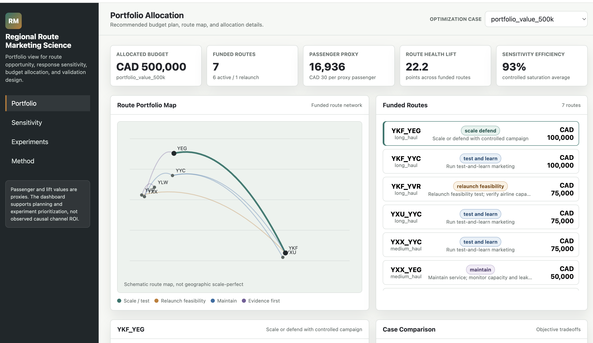

# Interactive Dashboard

GitHub displays standalone HTML files as source code. Use this rendered preview link to open the dashboard:

[Open via htmlpreview.github.io](https://htmlpreview.github.io/?https://github.com/Junyichen1633/regional-route-marketing-science/blob/main/dashboard/route_marketing_portfolio_dashboard.html)

## Preview



The dashboard is a static HTML artifact and can also be opened locally from:

```text
dashboard/route_marketing_portfolio_dashboard.html
```
