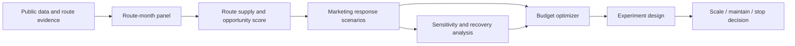

# Regional Air Route Marketing Science

## Executive Summary

This project builds a marketing science decision-support system for Canadian regional air routes. The goal is to decide which routes deserve marketing support, how much budget to allocate, and how the recommendation should be validated before scaling.

The project is deliberately not framed as a pure MMM. MMM-style response modeling is one component inside a broader route sustainability, response simulation, optimization, and experimentation workflow.

## Business Decision

Decision question:

> Which regional air routes should receive incremental marketing investment, and how should a fixed budget be allocated to maximize sustainable demand?

Primary decision owner:

- Regional airport commercial/marketing team, in partnership with airline network planning.

Decision cadence:

- Quarterly route-support planning with campaign-level validation windows.

## System Architecture



## Data Strategy

The project uses public airport context and sourced route-supply evidence. Because route-level passenger demand and marketing spend are usually proprietary, the project explicitly labels unobserved outcomes as proxies and simulated marketing as scenario-based.

Key modeling grain:

```text
route_id x month
```

Core limitations:

- Route-month passenger counts are not directly observed.
- Marketing spend is simulated, not real measured spend.
- Direct frequency is event-based and incomplete.
- Route-active labels come from sourced route events, not a complete schedule archive.

## Route Opportunity Readout

| Rank | Route | Status | Priority | Sustainability | Recommendation |
|---:|---|---|---:|---:|---|
| 1 | YKF_YVR | inactive | 81.9 | 76.7 | Relaunch feasibility test; verify airline capacity first |
| 2 | YKF_YEG | active | 71.6 | 73.3 | Scale or defend with controlled campaign |
| 3 | YKF_YYC | active | 68.1 | 76.3 | Run test-and-learn marketing |
| 4 | YXU_YVR | inactive | 67.4 | 68.8 | Relaunch feasibility test; verify airline capacity first |
| 5 | YXX_YYC | active | 65.9 | 77.5 | Run test-and-learn marketing |
| 6 | YXU_YYC | active | 63.4 | 80.8 | Run test-and-learn marketing |
| 7 | YKF_YHZ | active | 59.5 | 68.0 | Watchlist; improve evidence first |
| 8 | YXX_YEG | active | 58.7 | 71.6 | Maintain service; monitor capacity and leakage |

The important modeling choice is that `YKF_YVR` is not treated as an ordinary active-route scale candidate. It is a relaunch feasibility candidate because the route has strong demand context and strategic fit, but the end-of-period status is inactive.

## Marketing Sensitivity Readout

| Model spec | Top-channel recovery | Top-2 direction overlap | Budget-efficiency ratio | Rank corr. |
|---|---:|---:|---:|---:|
| controlled_saturation | 58% | 63% | 93% | 0.47 |
| controlled_adstock | 54% | 55% | 90% | 0.28 |
| naive_raw_spend | 8% | 49% | 82% | -0.05 |

Interpretation:

- Budget direction is more stable than exact channel ranking.
- Simulated marketing data should not be used to claim definitive channel ROI.
- The MMM-like controlled/saturation specification improves budget direction, but channel ranking remains fragile when effects are weak or channels are bought as a bundle.
- Google Meridian or a similar MMM component would be appropriate only after real spend variation and route-level outcomes are available.

## Recommended Budget Allocation

Recommended planning case: `portfolio_value_500k`

- Total budget: CAD 500,000
- Allocated budget: CAD 500,000
- Funded routes: 7
- Relaunch budget: CAD 75,000
- Incremental passenger proxy: 16,936
- Incremental route-health lift: 22.2 points
- Cost per incremental proxy passenger: CAD 30

| Route | Budget | Bucket | Incremental passenger proxy | Health lift pts |
|---|---:|---|---:|---:|
| YKF_YEG | CAD 100,000 | scale_defend | 917 | 4.5 |
| YKF_YYC | CAD 100,000 | test_and_learn | 2,646 | 3.4 |
| YKF_YVR | CAD 75,000 | relaunch_feasibility | 1,424 | 3.0 |
| YXU_YYC | CAD 75,000 | test_and_learn | 1,527 | 3.5 |
| YXX_YYC | CAD 75,000 | test_and_learn | 2,417 | 3.6 |
| YXX_YEG | CAD 50,000 | maintain | 1,798 | 2.6 |
| YLW_YVR | CAD 25,000 | maintain | 6,206 | 1.6 |

## Validation Plan

| Route | Design | Primary metric | Comparison routes | Power readiness |
|---|---|---|---|---|
| YKF_YEG | matched_route_geo_lift | route_bookings_or_booking_proxy | YHM_YEG, YHM_YYC, YHM_YVR | Low; use guardrail KPIs rather than definitive lift claim |
| YKF_YYC | matched_route_geo_lift | route_bookings_or_booking_proxy | YHM_YYC, YHM_YVR, YHM_YEG | Directional; pool with similar routes or extend test window |
| YKF_YVR | two_stage_capacity_gated_test | qualified_demand_signal | YXU_YVR, YHM_YVR, YHM_YYC | Feasibility only until capacity is committed |
| YXU_YYC | matched_route_geo_lift | route_bookings_or_booking_proxy | YHM_YYC, YHM_YEG, YHM_YVR | Directional; pool with similar routes or extend test window |
| YXX_YYC | matched_route_geo_lift | route_bookings_or_booking_proxy | YLW_YYC, YKF_YHZ, YLW_YEG | Medium; validate with booking or search-conversion data |
| YXX_YEG | incrementality_guardrail_test | route_booking_proxy_or_search_lift | YLW_YEG, YKF_YHZ, YLW_YYC | Directional; pool with similar routes or extend test window |
| YLW_YVR | incrementality_guardrail_test | route_booking_proxy_or_search_lift | YLW_YYC, YLW_YEG, YHM_YVR | Medium; validate with booking or search-conversion data |

Validation principle:

- Active routes should be tested with matched-route or geo-lift designs where booking or search-conversion data is available.
- Relaunch routes should be treated as two-stage capacity-gated feasibility tests.
- Public data can prioritize tests, but partner data is required to validate incrementality.

## Vertex AI / Meridian Path

A production-grade version would use Google Cloud as follows:

- Store route-month panel, campaign spend, and booking outcomes in BigQuery.
- Use Vertex AI Pipelines to rebuild features, score route opportunity, run response models, and optimize budgets.
- Use Vertex Experiments to compare route-health, passenger-growth, and portfolio-value objectives.
- Use Meridian only when real marketing spend and route-level outcomes exist; until then, keep the response module scenario-based.
- Export recommendations to Looker Studio or a lightweight dashboard for planning review.

## Interview Framing

This project demonstrates L4-level product data science because it handles an ambiguous business problem under imperfect data, avoids false causal claims, builds a complete decision workflow, and proposes an experiment design to validate recommendations.

Strongest takeaways:

- Reframed MMM as a component, not the whole project.
- Built a route-level decision system despite public-data constraints.
- Used sensitivity/recovery simulation to test what simulated marketing data can and cannot prove.
- Connected modeling output to budget allocation and validation design.
